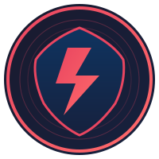

<p align="center">
  
</p>

<h1 align="center">Reflex</h1>

<p align="center">
  <strong>Self-correcting intelligence for AI agents using less capable models</strong>
</p>

<p align="center">
  <a href="https://github.com/Milk825/reflex/releases"></a>
  <a href="https://openclaw.ai"></a>
</p>

<p align="center">
  
  
  
  
</p>

---

## Why Reflex Exists

Accessible language models—local runners, budget APIs, self-hosted solutions—excel at reasoning but struggle with **resilience**. When they fail, they loop. When they loop, they hallucinate. When they hallucinate, you pay for wasted tokens and broken workflows.

**Reflex closes the gap.**

Instead of asking "how do we afford better models?" we asked "how do we make the models we have *smarter about knowing when they're stuck?*"

The answer: intercept, evaluate, adapt—*before* execution, not after. Reflex gives any language model the self-correcting reflex of premium systems, locally and at zero API cost.

---

## What It Does

Reflex sits between your agent's reasoning and the outside world. Every tool call gets evaluated through six signals of confidence. When patterns indicate trouble, Reflex intervenes—blocking, suggesting alternatives, or switching approaches entirely.

| Without Reflex | With Reflex |
|----------------|-------------|
| Try → Fail → Try same → Fail → Hallucinate → Loop forever | Try → Fail → Detect pattern → Switch approach → Try different → Succeed |
| Reacts to failure after it happens | Prevents failure before it occurs |
| Manual intervention required | Self-correcting autonomy |
| Accessible models with brittle behavior | Accessible models with premium resilience |

---

## Core Capabilities


**🔍 Pattern Detection**
- Identifies looping, over-eagerness, and confidence collapse in real-time
- Learns from telemetry without manual teaching
- Fingerprint-based matching, not keyword filtering

**🛡️ Intervention Engine**
- Circuit breaker for failing tools
- Pre-flight risk assessment
- Automatic fallback to alternative approaches

**📊 Confidence Calibration**
- Six-signal scoring: history, health, risk, ambiguity, complexity, meta-penalty
- Calibrated thresholds that adapt to context
- Transparent decision logging

**⚡ Zero Overhead**
- Local Python execution—no API calls
- Sub-10ms latency per interception
- Bounded memory, graceful degradation

---

## Three Modes of Operation

| Mode | Behavior | Use Case |
|------|----------|----------|
| **Shadow** | Observe, log, never intervene | Learning patterns, building trust |
| **Suggest** | Recommend, let user decide | Collaborative workflows |
| **Active** | Intervene when confidence is low | Autonomous operation |

Graduate from Shadow → Suggest → Active as confidence builds.

---

## Democratizing Intelligence

The best AI capabilities shouldn't require the most expensive models.

**Reflex enables:**
- Students running local models
- Indie devs on tight budgets  
- Teams scaling cost-effectively
- Anyone who wants careful AI without the premium price

**Same models. Smarter behavior. Fraction of the cost.**

---

## Quick Start

```bash
# Install the OpenClaw plugin
npm install -g openclaw-plugin-reflex

# Enable in your OpenClaw config
openclaw config set agents.defaults.reflex.enabled true
openclaw config set agents.defaults.reflex.mode shadow

# Start in shadow mode—watch, learn, zero risk
openclaw chat
```

Check what Reflex observed:
```bash
openclaw telemetry reflex recent
```

---

## Architecture

Reflex implements the MAPE-K loop (Monitor, Analyze, Plan, Execute, Knowledge) at the tool interception layer:

```
User Request → LLM Reasoning → Tool Decision → [REFLEX INTERCEPTION] → Execution
                                               ↓
                                         Confidence Scoring
                                         Pattern Matching
                                         Intervention Decision
                                               ↓
                                         PROCEED / BLOCK / SWITCH / ASK
```

- **TypeScript Plugin:** Hooks into OpenClaw's `before_tool_call` and `after_tool_call`
- **Python Core:** Confidence scoring, pattern detection, intervention logic
- **Bridge:** Unix Domain Socket for sub-10ms communication
- **Telemetry:** SQLite + JSONL for pattern learning

---

## Safety First

Reflex is designed to fail safely:

- **Fail-open:** If Reflex crashes, tools proceed normally—no deadlock
- **Circuit breaker:** Auto-disables after repeated faults
- **Shadow mode:** Learn patterns without risk before going active
- **Transparent:** Every decision logged, every intervention auditable

---

## Performance

| Metric | Value |
|--------|-------|
| **Latency** | <10ms per tool call (p95: ~2.6ms) |
| **Memory** | ~50-100MB bounded cache |
| **CPU** | Local Python, negligible overhead |
| **Tokens** | Zero additional API cost |

---

## Documentation

- [Installation Guide](./docs/installation.md)
- [Configuration Reference](./docs/configuration.md)
- [Architecture Deep-Dive](./docs/architecture.md)
- [Contributing](./CONTRIBUTING.md)

---

<p align="center">
  <strong>Built for OpenClaw. Designed for builders.</strong>
</p>
